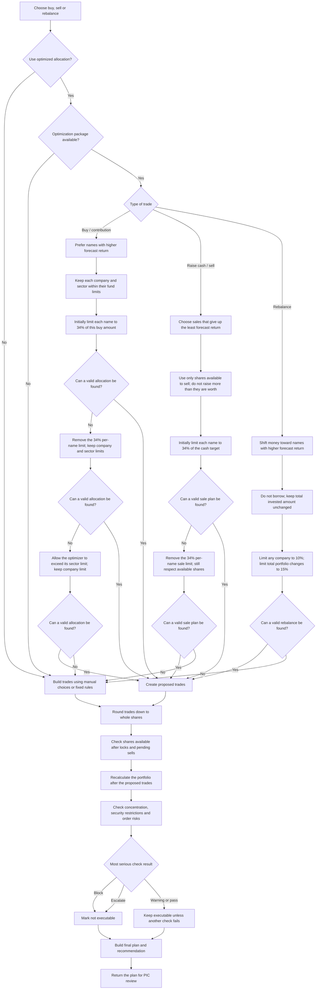

# How Optimization and Compliance Work

## The Short Version

The allocation engine first **suggests which shares to buy or sell**. It uses forecast returns and limits while building that suggestion. Then a separate policy check reviews the proposed trades against the fund's limits and execution rules.

**A suggestion from the optimizer is not approval.** A plan can still be returned for review when a rule blocks it. In that case, the plan says it is not executable.

The numbers here are current demo settings from code. They are not confirmed legal or fund mandates.

## Flow

If optimization is unavailable or cannot produce an allocation after the allowed retries, the planner switches to its fixed rule-based approach. Those resulting trades still go through the same policy checks.

## 1. Limits Used While Suggesting Trades

An **issuer** means one company/security. A **sector** means an industry grouping, such as Financial Services. A **fund weight** is the percentage of the fund's assets represented by a holding or group of holdings.

The buy optimizer uses these fund-specific company and sector limits:

| Fund | Maximum in one company | Maximum in one sector |
|---|---:|---:|
| HDFC Flexi Cap | 10% | 35% |
| ICICI Prudential Large Cap | 10% | 35% |
| SBI Nifty 50 ETF | 13% | 30% |
| HDFC Retirement Equity | 10% | 30% |
| Kotak Large & Mid Cap | 10% | 35% |

These values are configured in `backend/app/data_v2.py`. They are demo settings and should not be assumed to be approved fund limits.

### When the plan buys shares

The optimizer tries to invest the requested amount in names with the highest expected return, while:

- Never proposing a negative buy.
- Allocating the full requested amount in its mathematical solution.
- Keeping projected issuer, sector, group, and country exposure within their hard limits. An inherited breach may remain unchanged within the policy's 0.01 percentage-point tolerance.
- Keeping total buys within the policy cash budget. ADV participation thresholds are warning/escalation checks, not `BLOCK` thresholds, so they do not make a requested allocation infeasible.
- Excluding securities whose trade would be blocked for restriction, ESG exclusion, stale price, excessive spread, or foreign-currency exposure.
- Initially putting no more than 34% of the requested amount into any one name.

**Example:** for a ₹100 Cr buy, the first attempt puts at most ₹34 Cr into any one name. If that diversification restriction makes a solution impossible, the optimizer removes only that per-name limit and retries. The issuer, sector, group, country, and cash limits remain hard constraints. If they make the requested allocation infeasible, the planner falls back to its rule-based path and the final policy review can block the resulting plan. ADV participation is evaluated after the solve because its thresholds warn or escalate rather than block.

For a contribution, exposure percentages are measured against the fund's existing assets plus the new contribution. Other buys use the current AUM as a conservative constraint basis.

### When the plan sells shares

The optimizer tries to raise the requested cash by selling names with lower forecast returns first, to give up less forecast return. It:

- Uses only shares marked available to sell.
- Preserves the configured minimum holding and accounts for pending sells.
- Keeps projected issuer, sector, group, and country exposure within hard limits.
- Cannot raise more than the total value of those available shares.
- Initially limits any one name to 34% of the requested cash target.
- Removes only that 34% per-name limit if no solution can be found; available-share limits remain.

Because orders use whole shares, actual cash raised can be a little below the target.

### When the plan rebalances

The rebalance optimizer tries to increase weights in names with higher forecast returns. It:

- Does not short securities: weights cannot go below zero.
- Keeps the total invested amount unchanged, so it is cash-neutral before share rounding.
- Uses the active fund's issuer, sector, group, and country limits.
- Prevents buys in securities blocked by hard trade eligibility rules.
- Limits the sum of absolute weight changes to 15% of fund assets. In plain terms, the combined size of all increases and decreases is limited to 15 percentage points of assets.

After optimization, planner code ignores rebalance changes below ₹0.25 Cr and caps each sale at shares available to sell.

## 2. Rules Checked After Trades Are Proposed

The optimizer enforces the hard allocation constraints above. These policy checks still run **after** orders are built, including for rule-based or manual plans, and to catch differences from whole-share rounding or order construction. Warning and escalation bands, including ADV participation, are not optimization constraints: they may still flag a plan for review after the solve.

For company, sector, group, and country limits:

- **BLOCK:** projected exposure is above the limit.
- **WARN:** projected exposure reaches at least 90% of the limit, but is not blocked.
- **PASS:** projected exposure is below 90% of the limit.
- **Existing breach:** if the fund is already above a limit, a proposal that worsens it by no more than 0.01 percentage points is a warning; a larger worsening is blocked.

| Post-trade check | Rule in everyday terms | Result |
|---|---|---|
| Company / sector / group limits | Check the projected weight against the active fund's configured limit above. | Above limit: `BLOCK`; at 90% or more: `WARN`. |
| Group exposure | Add together holdings with the same business-group label. | Uses configured group caps, but active data currently labels each holding with its own ticker, so related companies are not actually combined. |
| 5/40 diversification check | Add the weights of all individual holdings that are each above 5%; compare the total with 40%. | Above 40%: `BLOCK`; at least 36%: `WARN`. This is only a simplified concentration check, not a full UCITS eligibility review. |
| Country exposure | Home country maximum 100%; foreign country 35%; 20% is selected for a foreign country only when an existing holding in that country is marked emerging. | Same 90%-warning and above-limit blocking rule. Default metadata marks holdings as India/non-emerging. As implemented, a first-time buy in an emerging country with no existing holding falls through to the 35% foreign-country cap. |
| Restricted or pledged security | Do not trade a restricted or pledged security. | `BLOCK`. |
| Watchlist | A security marked for internal review needs human attention. | `ESCALATE`. |
| Sell quantity | Do not sell more than available shares after existing pending sells, or sell below a required minimum holding. | `BLOCK`. |
| Excluded ESG security | Do not make new buys in configured excluded securities (the demo includes ITC and COALINDIA). Existing shares are not automatically sold. | `BLOCK` the buy. |
| Thermal power exposure | A buy with thermal-power-generation exposure above 20%. | `WARN`. |
| Stale price | Do not rely on a price marked stale. | `BLOCK`. |
| Trading liquidity | Compare order size with the lower of ADV and median ADV, then spread the participation across the plan horizon. ADV means average daily traded value. | More than 5% of effective ADV per day: `WARN`; more than 75%: `ESCALATE`. Missing ADV: `ESCALATE`. |
| Bid-ask spread | A spread above 0.5% signals higher trading cost; above 1% is unacceptable under this POC rule. | >0.5%: `WARN`; >1%: `BLOCK`. |
| Foreign currency | Measure the security's foreign-currency exposure. | >10%: `WARN`; >15%: `BLOCK`. |
| Corporate event | Warn close to an event date: within 1 day for dividend/ex-date events, within 2 days for other events. | `WARN`. Event calendar is curated, not live. |
| Cash available | Net buys must fit within 95% of available operating cash, plus 100% of a contribution explicitly added for this plan. | Above allowed cash: `BLOCK`. |
| Number of orders | Large plans need more review. | More than 50 orders: `WARN`; more than 100: `ESCALATE`. |
| Execution horizon | Long schedules need review. | More than 20 days: `ESCALATE`. |

The configured minimum large-cap allocation and maximum-cash percentages are displayed by the API but are **not checked** by these policy rules.

## 3. How the Checks Decide the Final Plan Result

Policy combines all check results in this order:

1. If any check is `BLOCK`, overall policy status is `BLOCK` and `execution_allowed` is false.
2. Otherwise, if any check is `ESCALATE`, overall policy status is `ESCALATE` and `execution_allowed` is false.
3. Otherwise, if any check is `WARN`, overall policy status is `WARN`; policy allows execution, but review is advised.
4. If all checks pass, overall policy status is `PASS` and policy allows execution.

The planner has a second, older concentration summary. A `FAIL` in that summary also makes the final plan's `execution_allowed` false. The summary is not identical to the main policy checks, so use the returned `policy_status` and `execution_allowed` fields for the clearest overall result.

Regardless of outcome, the system returns the proposed orders, checks, risk notes, and recommendation with initial status `Pending PIC Review`. A blocked proposal is returned for review; it is not silently discarded.

**Important:** the current PIC decision endpoint records `Approve` even if `execution_allowed` is false. It records a status only; it does not execute trades. Do not treat the approval label as an execution safeguard.

## Why Optimizer and Policy Can Disagree

- The optimizer is a way to construct a proposed allocation, not the final approval authority. Hard-limit infeasibility can trigger the rule-based fallback, and the resulting orders still go through policy checks.
- The active data labels each holding's business group with its ticker, so the configured group limit does not currently combine affiliated companies.
- Whole-share rounding, minimum rebalance ticket sizes, and execution order construction can change the projected portfolio after the continuous solve.
- The exact 5/40 rule is not represented as a convex constraint: it depends on counting only positions that individually exceed 5%. The post-order check remains authoritative for that rule.
- The expected returns are fixed illustrative values in `backend/app/forecast.py`, not live TFT predictions. The optimizer's ranking is therefore a demo input.

## Code Locations

| Responsibility | File and function |
|---|---|
| Set optimizer goals, constraints, and retry behavior | `backend/app/optimizer.py`: `optimize_buy`, `optimize_sell`, `optimize_rebalance` |
| Pick allocation method, fall back to rules, form orders, and build final plan | `backend/app/planner.py`: `_orders_by_optimizer`, `_orders_by_rules`, `generate_plan` |
| Recheck concentration, eligibility, execution, cash, and plan limits | `backend/app/policy.py`: `_concentration_checks`, `_order_checks`, `evaluate` |
| Provide active fund limits and holdings | `backend/app/data_v2.py`: `FUND_COMPLIANCE_LIMITS` |
| Provide expected returns | `backend/app/forecast.py`: `predict_returns` (placeholder data) |