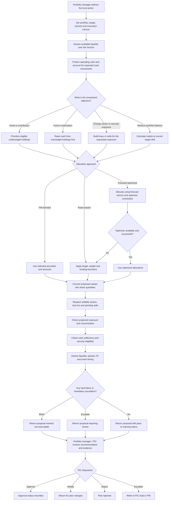

# Trade Plan: Business Flow

This describes the portfolio-management decisions represented by the trade-planning process. It is a business view of current code behavior, not a statement of approved investment policy. Configured limits and forecasts are demo assumptions unless independently approved.

## End-to-End Business Flow



## What Each Business Step Means

### 1. State the portfolio objective

The plan begins with a fund and an intended action:

- **Contribution:** invest incoming cash.
- **Redemption:** raise cash for an investor payout.
- **Increase / buy / add:** increase exposure to selected sectors or names.
- **Decrease / sell / trim / raise cash:** reduce exposure or raise liquidity.
- **Rebalance:** bring holdings closer to their target weights.

The requested amount and horizon shape the plan. For a sector action, the target is mapped to a supported sector; an unrecognized target can result in no proposed trades and a warning.

### 2. Establish deployable liquidity

The process estimates cash available across the horizon rather than treating the cash balance as wholly free to invest:

`cash - reserve + pending settlement cash + dividends due - expense accrual + estimated subscriptions - estimated redemptions`

The estimate is floored at zero. The current demo reserves 1% of AUM; estimates subscriptions at 0.08% of AUM and redemptions at 0.06%; includes dividend receipts due within the horizon; and subtracts daily expense accrual multiplied by the horizon. A new contribution is added separately and may be fully deployed. For other available cash, the policy allows 95% deployment, retaining a 5% buffer.

### 3. Shape the proposed trades

The action determines the business objective; the selected allocation approach determines how the names and quantities are chosen.

| Objective                | Current allocation logic                                                                                                                                                                                                                                                               |
| ------------------------ | -------------------------------------------------------------------------------------------------------------------------------------------------------------------------------------------------------------------------------------------------------------------------------------- |
| Invest contribution      | Rules path first fills eligible holdings below target in proportion to their shortfall, then allocates the remainder by target weights. Optimizer path chooses buys using forecast returns, subject to its constraints.                                                                |
| Fund redemption          | Rules path trims overweight holdings first, then sells pro rata to current weights. Optimizer path sells positions with lower forecast returns first. Both are limited by available sellable quantities; cash raised can be below the requested amount.                                |
| Increase sector exposure | Amount is split across selected sectors. Rules path applies fixed buy weights where defined; otherwise uses held names by weight. Optimizer path uses forecast-ranked eligible candidates. If buys exceed available cash, the planner attempts funding sells outside selected sectors. |
| Reduce sector exposure   | Rules path splits the reduction across target sectors and sells the largest-weight holdings first. Optimizer path minimizes forecast return given up. Both honor sellable capacity.                                                                                                    |
| Rebalance                | Rules path corrects target drift while preserving the current invested proportion. Optimizer path re-tilts toward higher forecast return, stays cash-neutral, and limits turnover.                                                                                                     |
| PM-directed allocation   | Uses explicitly selected names and amounts. Buys are later tested against cash policy; sells are capped to held/sellable shares.                                                                                                                                                       |

The default method is forecast-optimized. If the optimizer is unavailable or fails, the plan uses the rules-based approach and carries a warning. The actual method used is reported with the proposal.

### 4. Convert proposed values to orders

Proposed rupee allocations are converted to whole shares using the selected price; fractional shares are rounded down. Locked shares and existing pending sells reduce how many shares may be sold. Rule-based contribution/redemption paths skip per-name allocations below ₹0.50 Cr; rule-based rebalance skips deltas below ₹0.25 Cr. These ticket floors are not universal: the optimizer and manual paths do not enforce the same minimums.

### 5. Test the proposed portfolio and execution plan

The plan is checked against projected post-trade exposure and order-level controls. The business questions include:

- Would issuer, sector, group, country, or 5/40-style concentration exceed configured limits?
- Is the security restricted, pledged, watchlisted, stale-priced, or excluded for a configured ESG reason?
- Does a sale exceed sellable shares after pending sells, or breach a minimum holding?
- Is order participation reasonable for effective ADV over the requested horizon, and is the spread acceptable?
- Is foreign-currency exposure within thresholds, and is an event/dividend date close enough to warrant caution?
- Does the plan stay within deployable cash, order-count, and horizon controls?

Policy outcomes are combined by severity: any `BLOCK` makes the policy result `BLOCK`; otherwise any `ESCALATE` makes it `ESCALATE`; otherwise warnings give `WARN`; otherwise `PASS`. Warning-only policy results are marked execution-allowed. A block or escalation marks the plan not executable, but does not erase the proposal: it is still returned for review.

The planner also creates a separate concentration summary and risk flags. These are not identical to the policy result. In particular, use `policy_status` and `execution_allowed` as the overall policy outcome, not the display-only compliance summary by itself.

### 6. Make a human disposition

The output is a recommendation, not an automated investment decision. The intended PIC choices are Approve, Modify, Reject, or Escalate. The current API records the decision and updates the plan status, but it does not prevent Approve when `execution_allowed` is false and does not route an approved order to a trading system. Approval status therefore must not be treated as an execution safeguard.

## Where the Business Flow Lives in Code

| Business responsibility                                                                        | Responsible source           | Main function / role                                                                                                                        |
| ---------------------------------------------------------------------------------------------- | ---------------------------- | ------------------------------------------------------------------------------------------------------------------------------------------- |
| Select the fund book and provide current holdings, cash, targets, pending trades, and metadata | `backend/app/data_v2.py`   | Builds the active disclosure-backed fund datasets.`backend/app/data.py` supplies the synthetic reference universe and legacy data.        |
| Coordinate plan creation, cash planning, trade construction, and recommendation                | `backend/app/planner.py`   | `generate_plan` orchestrates the business flow; `cash_flow_planning` estimates deployable cash; action builders create proposed orders. |
| Apply portfolio and order policy controls                                                      | `backend/app/policy.py`    | `evaluate` combines concentration and per-order checks into policy status and `execution_allowed`.                                      |
| Choose forecast-driven allocations when requested                                              | `backend/app/optimizer.py` | `optimize_buy`, `optimize_sell`, and `optimize_rebalance` solve allocation problems.                                                  |
| Supply expected returns used by allocation                                                     | `backend/app/forecast.py`  | Currently returns illustrative hard-coded 1-month forecasts; it does not run TFT inference.                                                 |
| Record the plan and PIC disposition                                                            | `backend/app/main.py`      | Calls the planner, stores the plan in process memory, and records reviewer decisions.                                                       |

### Orchestrate the Proposal

`backend/app/main.py` delegates plan construction to the planner, then keeps the result for later review:

```python
plan = planner.generate_plan(fund_id or req.fund_id, req.model_dump(exclude={"fund_id"}))
_PLANS[plan["plan_id"]] = plan
return plan
```

### Estimate Deployable Cash

`backend/app/planner.py:cash_flow_planning` adjusts cash for reserves and expected movements before sizing trades:

```python
investable = total_cash - reserves + pending_net + dividends - expenses + net_flows
"investable_amount": max(investable, 0.0)
```

### Choose an Allocation Path

`backend/app/planner.py:generate_plan` uses the optimizer when available; if it is unavailable or fails, it falls back to rules-based orders:

```python
elif requested_method == "optimize":
    if not optimizer.available():
        method_used = "rules"
        orders, funding_sources, risk_notes, warnings = _orders_by_rules(
            ds, action, sectors, amount, investable, target)
    else:
        try:
            orders, funding_sources, risk_notes, warnings, opt_meta = _orders_by_optimizer(
                ds, action, sectors, amount, investable, returns)
        except Exception:
            method_used = "rules"
            orders, funding_sources, risk_notes, warnings = _orders_by_rules(
                ds, action, sectors, amount, investable, target)
```

The optimizer's buy objective and hard constraints are in `backend/app/optimizer.py:optimize_buy`:

```python
cons = [cp.sum(buy) == amount_u, cur + buy <= issuer_cap_u]
return cp.Problem(cp.Maximize(ret @ buy), cons)
```

### Turn Checks into a Business Outcome

`backend/app/policy.py:evaluate` prioritizes blocks, then escalations, then warnings. Warning-only plans remain allowed by this policy result:

```python
"status": "BLOCK" if blocking else ("ESCALATE" if escalation else ("WARN" if counts["WARN"] else "PASS")),
"execution_allowed": not blocking and not escalation,
```

### Record PIC Disposition

`backend/app/main.py:decide_trade_plan` maps the review choice to a status and records it on the plan:

```python
status_map = {
    "Approve": "Approved — sent to Trading",
    "Modify": "Returned for Modification",
    "Reject": "Rejected",
    "Escalate": "Escalated to PIC Lead / PM",
}
plan["status"] = status_map[req.decision]
```

This records a decision only; the current code does not enforce `execution_allowed` here or submit trades to a trading system.

## Assumptions That Can Change the Business Result

- **Forecasts are placeholders:** expected one-month returns are hard-coded illustrative values, not live TFT output. Optimizer allocations should not be interpreted as evidence-based forecasts.
- **Active holdings versus planner reference data:** active fund books come from disclosure-backed data, but some planner lookups prefer the synthetic universe. A matching name may therefore be priced or sector-classified from synthetic data, changing proposed shares, order value, or exposure attribution.
- **Groups are not consolidated:** active disclosure holdings use ticker as the group fallback. The configured group cap therefore does not aggregate actual parent/business groups.
- **Share-count derivation is suspect:** the active dataset's derived share formula appears 1,000 times smaller than the rupee market-value / price calculation. This can distort sellable shares, lock-ins, and dividends.
- **Liquidity and event inputs are curated:** estimated ADV/spreads and event dates support demo checks; they are not live execution or corporate-action feeds.
